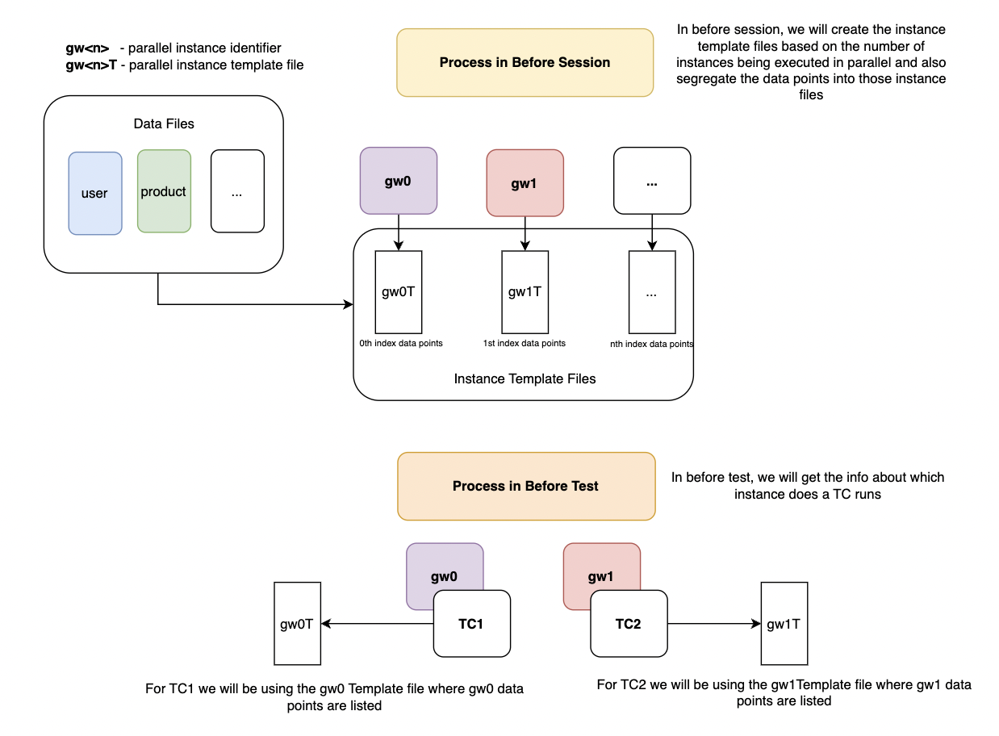

## The question of WHY ?

-   Let's say there is a given scenario,

    -   Parallel Execution
    -   2 Test cases
        -   T0 & T1
    -   2 Different data sets / points
        ```
        {
            "name": "James",
            "email": "james@email.com"
        },
        {
            "name": "Lindy",
            "email": "lindy@email.com"
        }
        ```
    -   When started no one test case should get same data set / points<br> i.e.
        -   T0 - James & james@email.com
        -   T1 - Lindy & lindy@email.com

## Tech stack used

-   Programming language - **Python**
-   Test runner - **Pytest**
-   Parallel Executer Plugin - **pytest-xdist**

## Problem that occurred...

-   We don't know which instance is going to be started due to which we will not be able to figure out which data point to be used for what instance

## Approach

1. In the session scope capture the number of instances to be triggered

2. Once captured create a template files for those instance files

3. Now split the data points into these instance files equally from data DIR for all data files ( data file should end with \*\*\_pool_data.json )

4. Store the instance meta data in the environment variable before running the test to identify which instance file to consider

5. Write a method to retrieve the meta info about the instance from environment stored and then get data from instance file

## Project Structure

```
+-- data
    +-- product_pool_data.json
    +-- user_pool_data.json
+-- test
    +-- test_file_1.py
    +-- test_file_2.py
+-- conftest.py
+-- pool.py
+-- requirements.txt
+-- .gitignore
```

## Setup

```
1. Create virtual env
   python3 -m venv venv

2. Activate virtual env
   source ./venv/bin/activate

3. Install python dependencies
   pip3 install -r requirements.txt

4. Run & experiment
   pytest -n <Instances - 2 or 3>

5. Observe the changes in debug.txt, gw*.json files created
```

## Workflow Diagram



## Note: Not a Generic Solution